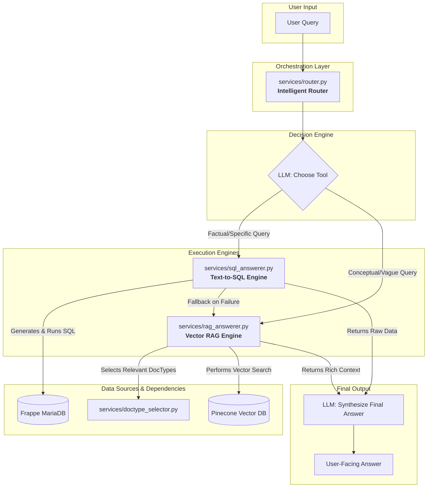

# TAP LMS - Conversational AI Engine

This project extends the TAP LMS Frappe application with a powerful, conversational AI layer. It provides a single, robust API endpoint that can understand user questions and intelligently route them to the best tool—either a direct database query or a semantic vector search—to provide accurate, context-aware answers.

The system is designed for multi-turn conversations, automatically managing chat history to understand follow-up questions.

## 🚀 Core Architecture

The system's intelligence lies in its central router, which acts as a decision-making brain. When a query is received, it follows this flow:

1. **Intelligent Routing:** An LLM analyzes the user's query to determine its intent.
2. **Tool Selection:**
   - For factual, specific questions (e.g., "list all...", "how many..."), it selects the **Text-to-SQL Engine**.
   - For conceptual, open-ended, or summarization questions (e.g., "summarize...", "explain..."), it selects the **Vector RAG Engine**.
3. **Execution & Fallback:** The chosen engine executes the query. If it fails to produce a satisfactory answer, the system automatically falls back to the Vector RAG engine as a safety net.
4. **Answer Synthesis:** The retrieved data is passed to an LLM, which generates a final, human-readable answer.



## 📦 Installation

Ensure TAP LMS is installed on the site:

```bash
bench get-app tap_lms <repo-url>
bench --site <site-name> install-app tap_lms
```

Add the code for this AI engine to the tap_lms app directory.

Finally, install the required Python libraries into the bench's virtual environment:

```bash
bench pip install langchain-openai pinecone-client frappe-client
```

## ⚙️ Configuration

Add the following keys to the site's `site_config.json`:

```json
{
  "openai_api_key": "sk-xxxx",
  "primary_llm_model": "gpt-4o-mini",
  "embedding_model": "text-embedding-3-small",

  "pinecone_api_key": "pcn-xxxx",
  "pinecone_index": "tap-lms-byo"
}
```

## 🧭 One-Time Setup

Follow these steps in order to initialize the system.

### 1) Generate the Database Schema

This script inspects the Frappe DocTypes and creates a `tap_lms_schema.json` file. This schema is crucial for both the Text-to-SQL and Vector RAG engines.

```bash
# Run this from app's root directory
python3 -m tap_lms.schema.generate_schema
```

### 2) Create the Pinecone Index

This command prepares Pinecone account by creating the vector index where document embeddings will be stored.

```bash
bench execute tap_lms.services.pinecone_index.cli_ensure_index
```

### 3) Populate the Pinecone Index (Upsert Data)

This command reads schema, processes the data from allow-listed DocTypes, creates embeddings, and saves them to Pinecone.

```bash
bench execute tap_lms.services.pinecone_store.cli_upsert_all
```

## 🧪 Testing from the Command Line

The primary entry point for all testing is the main router's CLI. It automatically manages conversation history for a given `user_id`.

### Turn 1: Ask an initial question

This can be a factual query (handled by SQL) or a conceptual one (handled by RAG).

```bash
# Factual Query (will use Text-to-SQL)
bench execute tap_lms.services.router.cli --kwargs "{'q':'list all course videos with basic difficulty', 'user_id':'test_user_1'}"

# Conceptual Query (will use Vector RAG)
bench execute tap_lms.services.router.cli --kwargs "{'q':'summarize the finlit video on needs vs wants', 'user_id':'test_user_1'}"
```

### Turn 2: Ask a follow-up question

The system will automatically use the cache to retrieve the history for `test_user_1` and understand the context.

```bash
bench execute tap_lms.services.router.cli --kwargs "{'q':'summarize the first one', 'user_id':'test_user_1'}"
```

## 🌐 Production REST API

### Endpoint

```
POST /api/method/tap_lms.api.query.query
```

### Authentication

The API uses Frappe's standard token-based authentication. Use an API Key and Secret generated from a dedicated API user.

```
Authorization: token <api_key>:<api_secret>
```

### Request Body

The API accepts a JSON body. The `user_id` is critical for maintaining separate conversation histories for different users (e.g., different WhatsApp numbers).

```json
{
    "q": "Your question here",
    "user_id": "whatsapp:+911234567890"
}
```

### Example curl Command

This is how an external service (like GCP webhook for WhatsApp) would call the API.

```bash
curl -X POST "http://your.frappe.site/api/method/tap_lms.api.query.query" \
 -H "Authorization: token <your_api_key>:<your_api_secret>" \
 -H "Content-Type: application/json" \
 -d '{
    "q": "summarize the video about goal setting",
    "user_id": "whatsapp:+911234567890"
 }'
```

## 🔍 Core File Descriptions

**`tap_lms/api/query.py`**: The production-ready REST API endpoint. It handles requests, manages authentication and rate limiting, and orchestrates the conversational flow by managing user-specific chat history in the cache.

**`tap_lms/services/router.py`**: The central brain of the system. It takes a user's query and chat history, uses an LLM to choose the best tool (`text_to_sql` or `vector_search`), and manages the fallback logic.

**`tap_lms/services/sql_answerer.py`**: The Text-to-SQL engine. It uses an intelligent schema builder to give an LLM rich context about the database, enabling it to generate accurate SQL queries for factual questions.

**`tap_lms/services/rag_answerer.py`**: The Vector RAG engine. It handles conceptual and summarization questions by finding semantically similar documents in the Pinecone index and using them as context for an LLM to synthesize an answer.

**`tap_lms/services/pinecone_store.py`**: Manages all interactions with the Pinecone vector database, including the data upsert pipeline and the search logic.

**`tap_lms/services/pinecone_index.py`**: Manages the Pinecone index lifecycle, including creation and deletion, via command-line functions.

**`tap_lms/services/doctype_selector.py`**: A crucial pre-processing step that uses an LLM to intelligently select the most relevant DocTypes for a given query, narrowing the search space for the RAG engine.

**`tap_lms/services/ratelimit.py`**: A utility for enforcing rate limits on API usage, using the Frappe cache to track requests.

**`tap_lms/schema/generate_schema.py`**: A utility script to generate a detailed JSON representation of your Frappe DocTypes, which is used by both the SQL and RAG engines.

**`tap_lms/infra/config.py`**: A centralized helper for retrieving configuration settings (like API keys) from `site_config.json`.

**`tap_lms/infra/sql_catalog.py`**: A simple loader for the `tap_lms_schema.json` file, making it accessible across different services.
